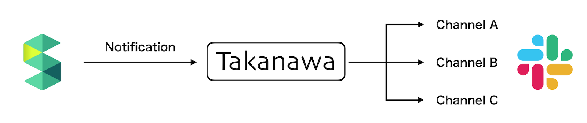
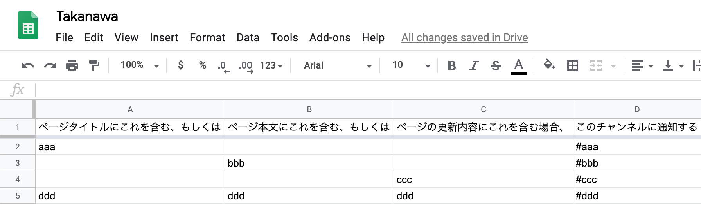

# Takanawa

Takanawa は Scrapbox の Slack 向け通知を受け取って、条件にマッチしたチャンネルに投稿を行うゲートウェイです。



## Setup

事前に https://github.com/google/clasp の導入は済ませておいてください。

```
$ npm install
$ clasp create --title "Takanawa" --type sheets --rootDir ./src
$ git checkout src/appsscript.json
$ clasp push
? Manifest file has been updated. Do you want to push and overwrite? Yes
└─ src/Takanawa.ts
└─ src/appsscript.json
Pushed 2 files.
$ clasp open
```

`clasp open` で Google Apps Script のエディタ画面が開くので、File メニューから Project properties を開き、Script properties に下記 4 つの環境変数を設定します。

- `SCRAPBOX_HOST`
  - Scrapbox のホストです。エンタープライズ版の場合はそのホスト名を、クラウド版の場合は `scrapbox.io` を設定します。
- `SCRAPBOX_PROJECT`
  - Scrapbox のプロジェクト名です。プロジェクトページの URL が https://scrapbox.io/june29 なら `june29` を設定します。
- `SCRAPBOX_COOKIE`
  - Scrapbox のプロジェクトがプライベート設定の場合、認証用に必要になります。
- `SLACK_WEBHOOK_URL`
  - Slack の Incoming Webhook の URL を設定します。

Google Apps Script をウェブアプリケーションとして公開したら、その URL を Scrapbox の Slack 通知先に指定してください。

## Rules

シートにルールを記述します。1 行目はヘッダ行になりますので、説明でも書いておきましょう。



上記のスクリーンショットのようにルールを記述した場合、通知先チャンネルは以下のように選ばれます。

- ページタイトルに aaa を含む場合、チャンネル #aaa に通知する
- ページ本文に bbb を含む場合、チャンネル #bbb に通知する
- ページの更新差分に ccc を含む場合、チャンネル #ccc に通知する
- ページのタイトルもしくは本文もしくは更新差分に ddd を含む、チャンネル #ddd に通知する
- ページのタイトルに aaa を含み、かつ本文に bbb を含む場合、チャンネル #aaa と #bbb に通知する
- どのルールにもマッチしない場合、Slack の Incoming Webhook で設定したチャンネルに通知する
